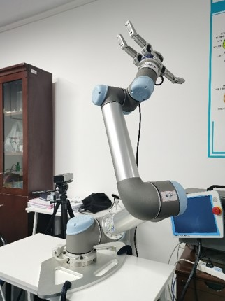

# UR5+Barrett Hand-ROS
In this repository, a guidance is given to run UR5 and Barrett hand in ROS environment.

**UR5+Barrett Hand/Ubuntu 16.04/ROS Kinetic  (Barrett Hand-Pcan-usb接口-PC)** 


##  setup Driver
###  1.Download UR5-related ros package
```
source /opt/ros/Kinetic/setup.bash
mkdir -p ur_ws/src && cd ur_ws
git clone https://github.com/UniversalRobots/Universal_Robots_ROS_Driver.git src/Universal_Robots_ROS_Driver
git clone -b calibration_devel https://github.com/fmauch/universal_robot.git src/fmauch_universal_robot
sudo apt update -qq
rosdep update
rosdep install --from-paths src --ignore-src -y
catkin_make
source devel/setup.bash
```
source devel/setup.bash只在当前终端生效，每次打开其他终端时都要重新source，这样比较麻烦。
- 解决方法：gedit ~/.bashrc，打开.bashrc文件，在文件底部添加source ~/path/to/ur5/devel/setup.bash，保存退出即可。

###  2. Test robot in simulation
```
roslaunch ur_gazebo ur5.launch

roslaunch ur5_moveit_config ur5_moveit_planning_execution.launch sim:=true

roslaunch ur5_moveit_config moveit_rviz.launch config:=true
```  

###  3. testing with real-world UR5 robot
3.1 安装externalcontrol  
要在真正的机器人上使用ur_robot_driver，需要在ur机器人上安装externalcontrol-1.0.urcap，该文件位于Universal_Robots_ROS_Driver/ur_robot_driver的resources文件夹内。注意：要安装此URCap，要求PolyScope的版本不得低于3.7。  
安装步骤：  
a.用U盘将此文件拷贝至机器人示教器的programs文件夹。  
b.在欢迎屏幕上，选择Setup Robot，然后选择URCaps进入URCaps安装屏幕。  
c.单击底部的小加号以打开文件选择器。 在此处，可以看到存储在机器人程序文件夹或插入的USB驱动器中的所有urcap文件。 选择并打开externalcontrol-1.0.urcap文件，然后单击打开。 现在，您的URCaps视图应在活动的URCaps列表中显示External Control，点击右下角重启机器人。  
d.重新启动后，选择为机器人编程，在安装设置部分中找到External Control 。 然后设置外部PC的IP地址，本文设置为192.168.1.101 。请注意，机器人和外部PC必须位于同一网络中，理想情况下，彼此之间应直接连接，以最大程度地减少网络干扰。 自定义端口现在应该保持不变。  
e.要使用新的URCap，请创建一个新程序并将External Control程序节点插入到程序树中。  
f.重新点击命令按钮，则会看到在安装中输入的设置。 检查它们是否正确，然后将程序保存，可以将程序命名为external_control.urp。 现在机器人可以与此驱动程序一起使用了。  

3.2 网络配置
设置机器人静态IP. 设置机器人 ——> 设置网络菜单：  
IP地址: 192.168.1.2  
子网掩码：255.255.255.0  
测试网络连接：  
```
ping 192.168.1.2  #IP_OF_THE_ROBOT
```  
会看到如下输出： 
```
64 bytes from 192.168.1.2: icmp_seq=1 ttl=64 time=0.518 ms  
64 bytes from 192.168.1.2: icmp_seq=2 ttl=64 time=0.259 ms  
64 bytes from 192.168.1.2: icmp_seq=3 ttl=64 time=0.282 ms  
```
如果没有发生任何事情或引发错误，则无法从计算机访问机器人。  

3.3 用ros驱动真实的ur5机器人  
a.网线连接机器人和电脑，启动机器人  
b.打开电脑终端，启动机器人驱动程序
```
roslaunch ur_robot_driver ur5_bringup.launch limited:=true robot_ip:=192.168.1.2
```  
c.示教器，运行程序 —> 文件 —> 加载程序 —> 选择3.1 节保存的external_control.urp程序，打开—>运行。  
d.新终端启动moveit
```
roslaunch ur5_moveit_config ur5_moveit_planning_execution.launch limited:=true
``` 
此处报错：[ERROR]: Action client not connected: /follow_joint_trajectory  
解决：找到/ur5_moveit_config/config/controllers.yaml 文件，name: 后添加 scaled_pos_joint_traj_controller  
上述修改方法会导致用gazebo仿真时报错，因此使用gazebo时需要改回源文件中的 - name: ""  
e.新终端启动rviz 
```
roslaunch ur5_moveit_config moveit_rviz.launch config:=true
``` 
然后就可以拖动rviz中的ur5的末端，plan然后execute控制真实的UR5运动。注意观察plan的运行轨迹，慎防撞击。  
至此完成了用ros驱动真实ur5机器人。

###  4. pyHand包下载
下载[pyHand-2.0](https://git.barrett.com/firmware/bhand/tree/pyHand-2.0/)  

###  5.利用pyHand包中的示例驱动真实的Barrett Hand（Barrett Hand和PC用的是can-usb接口）
5.1USB接口连接电脑，启动机械手。  
5.2安装Python的can包   
`pip install python-can`  
报错不影响后面的使用，可略过。  
5.3运行前先设置  
`sudo ip link set can0 up type can bitrate 1000000`  
5.4示例修改  
进入bhand-pyHand-2.0/pyHand/Archive_pyHand_1.0/examples  
选择任意example，打开，修改    
sys.path.append('../../source/pyHand_API')中括号修改为自身电脑对应pyHand_API的路径。  
进入bhand-pyHand-2.0/pyHand/source/pyHand_API  
打开CAN_library_linux.py，修改    
from can.interfaces.interface import Bus为from can.interfaces import Bus  
然后python运行任意example  
至此完成了用pyHand示例驱动真实的Barrett Hand。

###  6.编写python程序驱动真实UR5+Barrett Hand
需要在ROS Kinetic上安装moveit  
`sudo apt-get install ros-kinetic-moveit`  
6.1电源及接线确保没问题  
6.2打开电脑终端，启动机器人驱动程序。  
`roslaunch ur_robot_driver ur5_bringup.launch limited:=true robot_ip:=192.168.1.2`  
6.3示教器，运行程序  
6.4新终端启动moveit  
`roslaunch ur5_moveit_config ur5_moveit_planning_execution.launch limited:=true`  
6.5运行前设置  
`sudo ip link set can0 up type can bitrate 1000000`  
6.6运行python script  
下列python程序实例将实现控制真实UR5+Barrett Hand模拟完成某处抓取物体移动至另一处放下物体的操作。
` python test_ur5.py`

## some tips
**1.UR5无法使用externalcontrol**  

* UR臂的驱动有三个：ur_driver, ur_modern_driver, ur_robot_driver。 ur_driver和ur_modern_driver已经被官方弃用，
  ur_robot_driver适用于polyscope >= 3.7 版本的UR机械臂和CB>=5的UR-e机械臂。  
* polyscope控制器版本能升级, 只能逐次升级，eg：3.4→3.5→3.6→3.7。[polyscope](http://support.universal-robots.cn/download/).
  电脑下载完后用U盘拷贝至UR控制器，在设置机器人中选择更新机器人软件，点击搜索逐步更新。  

**2.Barrett Hand-pcan-usb接口-PC**   

* 尝试过安装ros-barrett-pkg，但始终报错Errors on CAN bus. 
* 之后寻找peak-linux-driver安装存在问题，尝试各种peak-linux-driver版本  
* 也用过libbarrett（barrett做的ros package，是基于libbarrett库来做的）  
* can通信测试发现是有通讯上的，总结应该是16版本不支持，但听说也有成功的案例，具体原因可能涉及底层，暂未明白。  
因此最后是通过使用pyhand-2.0版本，修改example程序实现程序控制barrett hand。


